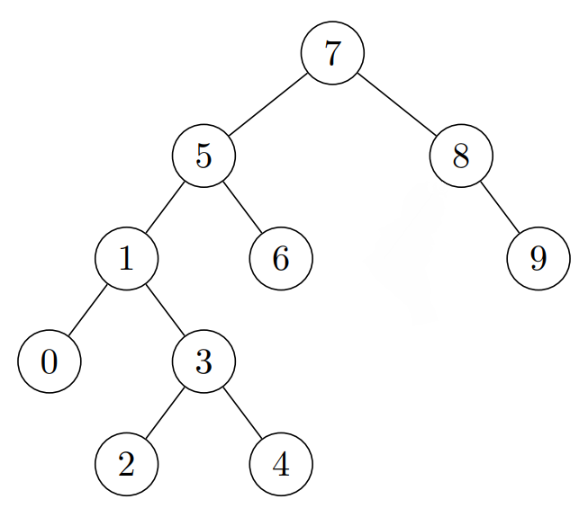

## Patika.dev - Veri Yapıları ve Algoritmalar -Proje 3 - Binary Search Tree Projesi

Proje 3
[7, 5, 1, 8, 3, 6, 0, 9, 4, 2] dizisinin Binary-Search-Tree aşamalarını yazınız.

Örnek: root x'dir. root'un sağından y bulunur. Solunda z bulunur vb.

- 1.Aşama: Sıralanmamış bu dizinin ilk elemanı 7 root(kök) olarak belirlenir.
- 2.Aşama: 5, 7den küçük olduğu için root'un soluna yazılır.
- 3.Aşama: 1, 7den ve 5ten küçük olduğu için 5in soluna yazılır
- 4.Aşama:8, 7den büyük olduğu için rootun sağına yazılır
- 5.Aşama:3, 5ten küçük 1den büyük olduğu için 1 in sağına yazılır
- 6.Aşama: 6, 7den küçük ve 5ten büyük olduğu için 5in sağına yazılır.
- 7.Aşama: 0, 5ten e 1den küçük olduğu için 1in soluna yazılır
- 8.Aşama:9, 7den ve 8den büyük olduğu için 8in sağına yazılır
- 9.Aşama:4, 5ten küçük 1den büyük ve 3ten büyük olduğu için 3ün sağına yazılır
- 10.Aşama:2, 7 ve 5ten küçük 1den büyük ve 3ten küçük olduğu için 3ün soluna yazılır.

[www.patika.dev](https://www.patika.dev/)